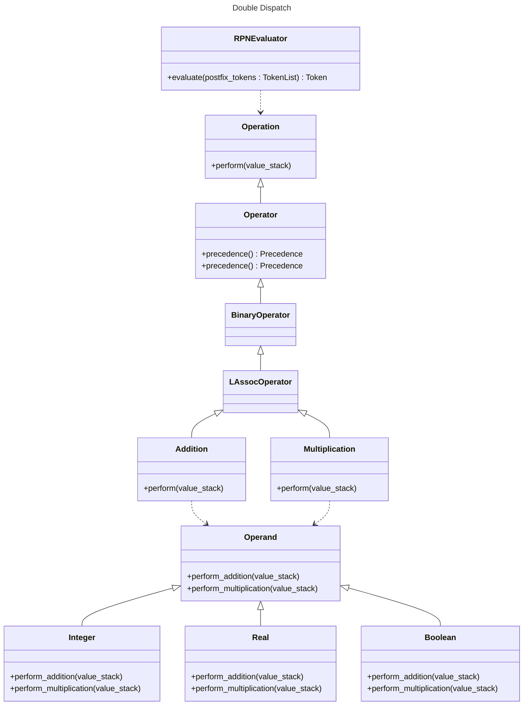

```mermaid
---
title: Double Dispatch
---
classDiagram
    class RPNEvaluator {
        +evaluate(postfix_tokens : TokenList) Token
    }

    class Operation {
        +perform(value_stack)
    }

    class Operator {
        +precedence() Precedence
    }

    class Operator {
        +precedence() Precedence
    }

    class BinaryOperator
    
    class LAssocOperator

    class Addition {
        +perform(value_stack)
    }

    class Multiplication {
        +perform(value_stack)
    }

    class Operand {
        +perform_addition(value_stack)
        +perform_multiplication(value_stack)
    }

    class Integer {
        +perform_addition(value_stack)
        +perform_multiplication(value_stack)
    }

    class Real {
        +perform_addition(value_stack)
        +perform_multiplication(value_stack)
    }

    class Boolean {
        +perform_addition(value_stack)
        +perform_multiplication(value_stack)
    }

    RPNEvaluator ..> Operation
    Operation <|-- Operator
    Operator <|-- BinaryOperator
    BinaryOperator <|-- LAssocOperator
    LAssocOperator <|-- Addition
    LAssocOperator <|-- Multiplication
    Addition ..> Operand
    Multiplication ..> Operand
    Operand <|-- Integer
    Operand <|-- Real
    Operand <|-- Boolean
```