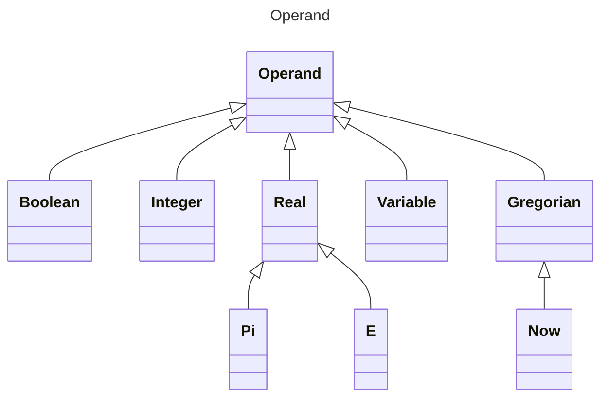

```mermaid
---
title: Operand
---
classDiagram
    class Operand

    class Boolean

    class Integer

    class Real

    class Variable

    class Pi

    class E

    class Gregorian

    class Now

    Operand <|-- Boolean
    Operand <|-- Integer
    Operand <|-- Real
    Operand <|-- Variable
    Operand <|-- Gregorian
    Real <|-- Pi
    Real <|-- E
    Gregorian <|-- Now
```