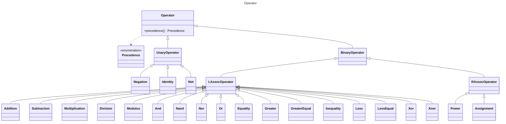

```mermaid
---
title: Operator
---
classDiagram
    class Precedence {
        <<enumeration>>
    }

    class Operator {
        +precedence() Precedence
    }

    class UnaryOperator
    class BinaryOperator

    class Negation
    class Identity
    class Not

    class LAssocOperator
    class RAssocOperator

    class Addition
    class Subtraction
    class Multiplication
    class Division
    class Modulus

    class And
    class Nand
    class Nor
    class Or

    class Equality
    class Greater
    class GreaterEqual
    class Inequality
    class Less
    class LessEqual

    class Xor
    class Xnor

    class Power
    class Assignment

    Operator ..> Precedence

    Operator <|-- UnaryOperator
    Operator <|-- BinaryOperator

    UnaryOperator <|-- Negation
    UnaryOperator <|-- Identity
    UnaryOperator <|-- Not

    BinaryOperator <|-- LAssocOperator
    BinaryOperator <|-- RAssocOperator

    LAssocOperator <|-- Addition
    LAssocOperator <|-- Subtraction
    LAssocOperator <|-- Multiplication
    LAssocOperator <|-- Division
    LAssocOperator <|-- Modulus

    LAssocOperator <|-- And
    LAssocOperator <|-- Nand
    LAssocOperator <|-- Nor
    LAssocOperator <|-- Or

    LAssocOperator <|-- Equality
    LAssocOperator <|-- Greater
    LAssocOperator <|-- GreaterEqual
    LAssocOperator <|-- Inequality
    LAssocOperator <|-- Less
    LAssocOperator <|-- LessEqual

    LAssocOperator <|-- Xor
    LAssocOperator <|-- Xnor
    
    RAssocOperator <|-- Power
    RAssocOperator <|-- Assignment
```