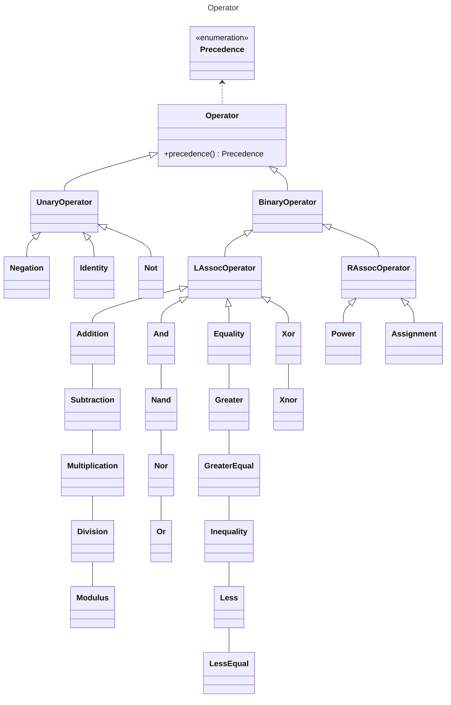

```mermaid
---
title: Operator
---
classDiagram
    class Precedence {
        <<enumeration>>
    }

    class Operator {
        +precedence() Precedence
    }

    class UnaryOperator
    class BinaryOperator

    class Negation
    class Identity
    class Not

    class LAssocOperator
    class RAssocOperator

    class Addition
    class Subtraction
    class Multiplication
    class Division
    class Modulus

    class And
    class Nand
    class Nor
    class Or

    class Equality
    class Greater
    class GreaterEqual
    class Inequality
    class Less
    class LessEqual

    class Xor
    class Xnor

    class Power
    class Assignment

    Precedence <.. Operator

    Operator <|-- UnaryOperator
    Operator <|-- BinaryOperator

    UnaryOperator <|-- Negation
    UnaryOperator <|-- Identity
    UnaryOperator <|-- Not

    BinaryOperator <|-- LAssocOperator
    BinaryOperator <|-- RAssocOperator

    LAssocOperator <|-- Addition
    Addition -- Subtraction
    Subtraction-- Multiplication
    Multiplication -- Division
    Division -- Modulus

    LAssocOperator <|-- And
    And -- Nand
    Nand -- Nor
    Nor -- Or

    LAssocOperator <|-- Equality
    Equality -- Greater
    Greater -- GreaterEqual
    GreaterEqual -- Inequality
    Inequality -- Less
    Less -- LessEqual

    LAssocOperator <|-- Xor
    Xor -- Xnor
    
    RAssocOperator <|-- Power
    RAssocOperator <|-- Assignment
```