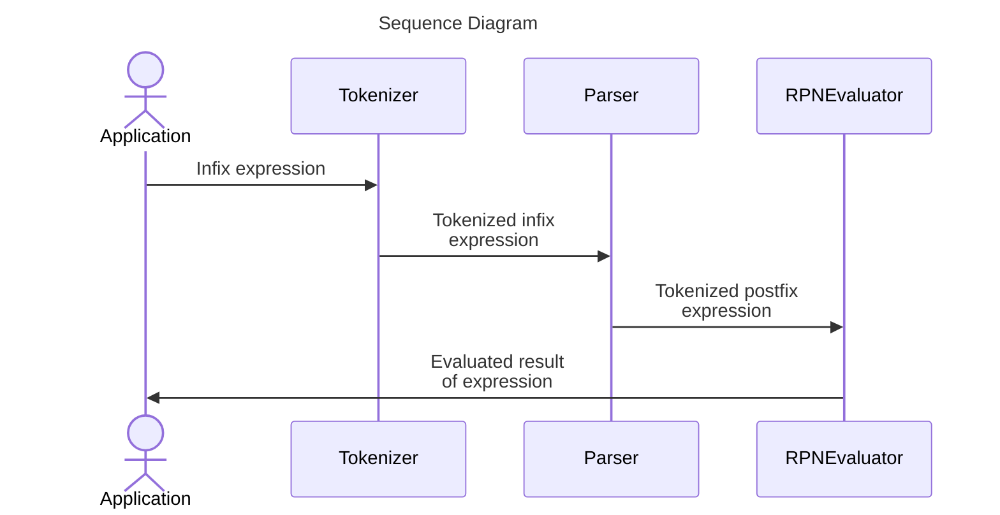
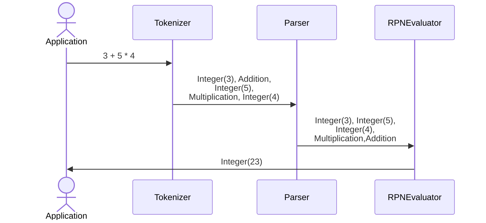

```mermaid
---
title: Sequence Diagram
---
sequenceDiagram
    actor Application
    participant Tokenizer
    participant Parser
    participant RPNEvaluator

    Application ->> Tokenizer: Infix expression

    Tokenizer ->> Parser: Tokenized infix<br>expression

    Parser ->> RPNEvaluator: Tokenized postfix<br>expression

    RPNEvaluator ->> Application: Evaluated result<br>of expression
```

```mermaid
sequenceDiagram
    actor Application
    participant Tokenizer
    participant Parser
    participant RPNEvaluator

    Application ->> Tokenizer: 3 + 5 * 4

    Tokenizer ->> Parser: Integer(3), Addition,<br>Integer(5),<br>Multiplication, Integer(4)

    Parser ->> RPNEvaluator: Integer(3), Integer(5),<br>Integer(4),<br>Multiplication,Addition

    RPNEvaluator ->> Application: Integer(23)
```