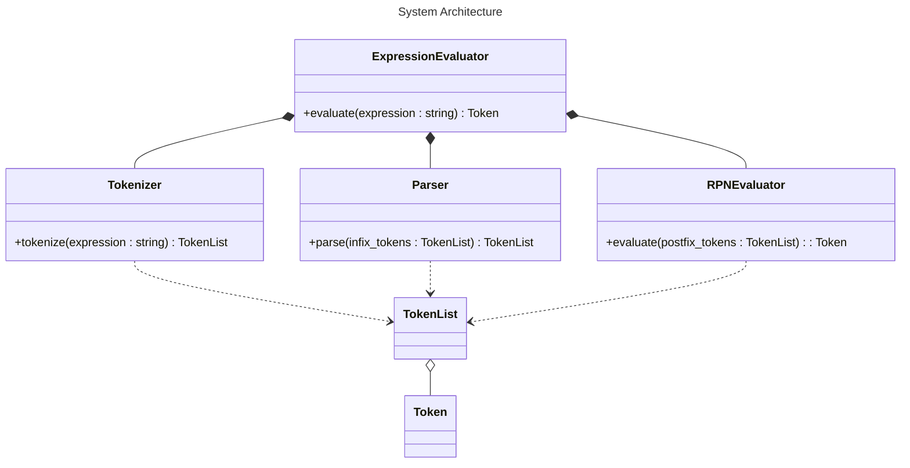

```mermaid
---
title: System Architecture
---
classDiagram
    class ExpressionEvaluator {
        +evaluate(expression : string) Token
    }

    class Tokenizer {
        +tokenize(expression : string) TokenList
    }

    class Parser {
        +parse(infix_tokens : TokenList) TokenList
    }

    class RPNEvaluator {
        +evaluate(postfix_tokens : TokenList) : Token
    }

    class TokenList

    class Token

    ExpressionEvaluator *-- Tokenizer
    ExpressionEvaluator *-- Parser
    ExpressionEvaluator *-- RPNEvaluator
    Tokenizer ..> TokenList
    Parser ..> TokenList
    RPNEvaluator ..> TokenList
    TokenList o-- Token
```