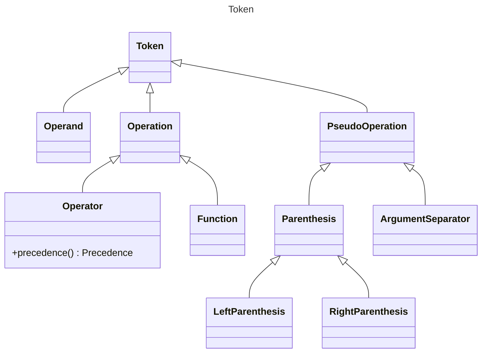

```mermaid
---
title: Token
---
classDiagram
    class Token

    class Operand

    class Operation

    class PseudoOperation

    class Operator {
        +precedence() Precedence
    }

    class Function

    class Parenthesis

    class ArgumentSeparator

    class LeftParenthesis

    class RightParenthesis

    Token <|-- Operand
    Token <|-- Operation
    Token <|-- PseudoOperation
    PseudoOperation <|-- Parenthesis
    PseudoOperation <|-- ArgumentSeparator
    Parenthesis <|-- LeftParenthesis
    Parenthesis <|-- RightParenthesis
    Operation <|-- Operator
    Operation <|-- Function
```