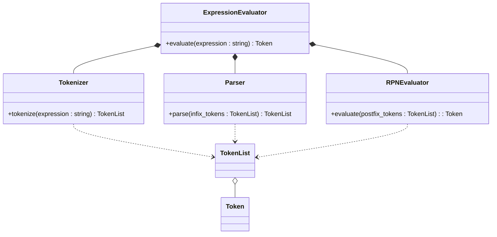
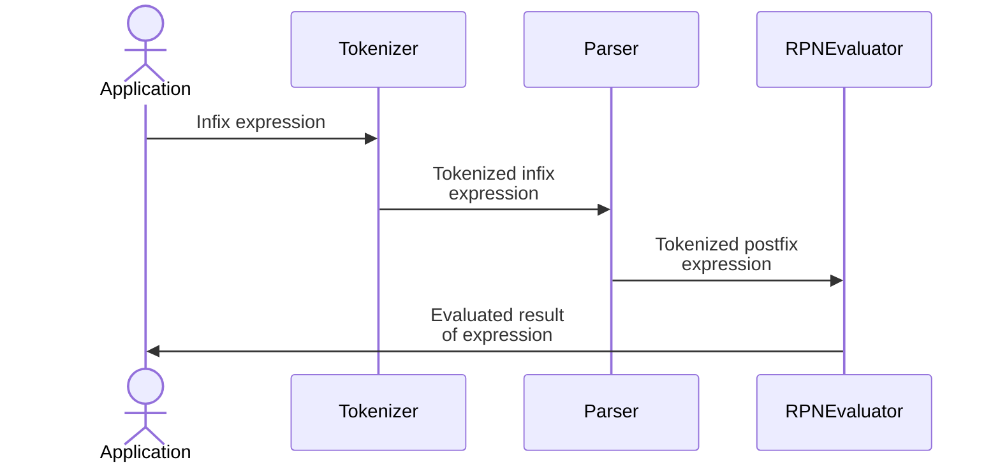
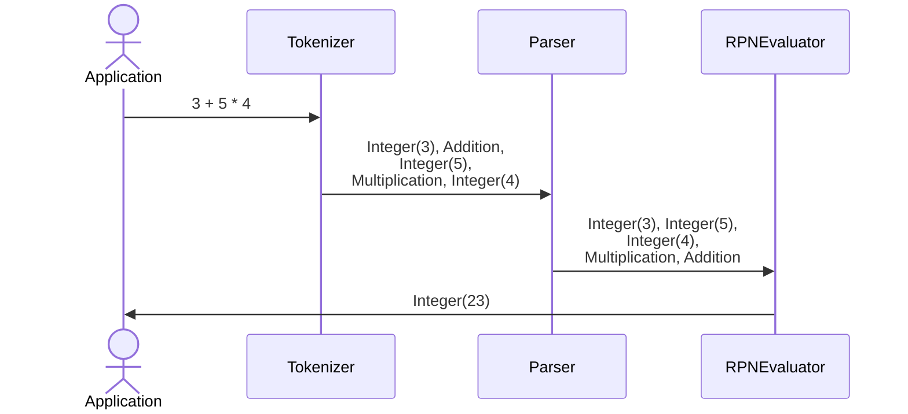

# Expression Evaluator

A Windows console application that **_evaluates mathematical expressions_** involving **_multiple operators_** and **_functions_**. This program supports operations on **_a variety of data types_**, including Boolean, Integer, Real, and Variable.

## Features

-   Supports **_various operators_**:

Type            |   Operators
:--------------:|:----------------------------------------------------------------
**Unary**       |   Negation (`-x`), Not (`!x`), Factorial (`x!`)
**Arithmetic**  |   Addition (`+`), Subtraction (`-`), Multiplication (`*`), Division (`/`), Modulus (`%`), Power (`**`)
**Assignment**  |   Assignment (`=`)
**Logical**     |   And (`&&`), Nand (`!&&`), Or (`\|\|`), Nor (`!\|\|`)
**Relational**  |   Equality (`==`), Inequality (`!=`), Greater (`>`), GreaterEqual (`>=`), Less (`<`), LessEqual (`<=`)
**Bitwise**     |   Xor (`^`), Xnor (`!^`)

-   Includes **_built-in functions_**:

Type                |Functions
:------------------:|:----------------------------------------------------------------
**One-Argument**    |`abs`, `arccos`, `arcsin`, `arctan`, `ceil`, `cos`, `day`, `exp`, `floor`, `month`, `lb`, `ln`, `log`, `sin`, `sqrt`, `tan`, `year`
**Two-Argument**    |`arctan2`, `max`, `min`, `pow`
**Three-Argument**  |`gregorian`

-   Handles **_multiple data types_**: Boolean, Integer, Real, Variable, and Gregorian.
-   Supports **_nested expressions_** and **_parentheses_** for complex calculations.
-   Simple, fast, and lightweight **_console-based_** interface.

## Shunting Yard Algorithm

The [Shunting Yard Algorithm](!docs/Parser.pdf) is a method for parsing **_infix notation_** (Standard mathematical expressions) to **_postfix notation_**, also known as **_reverse Polish notation_** (**_RPN_**). Given the fact that computers cannot naturally handle **_parentheses_** and **_operator precedence_** the way human do, this conversion leverages **_postfix notation_** to simplify expression evaluation as it allows for **_stack-based_** evaluation, making expression parsing and calculation simpler and more efficient.

-   Postfix notation is a mathematical notation in which **_operators follow their operands_**.
-   The notation does not need any **_parentheses_** for as long as each operator has a **_fixed number of operands_**.
-   This program implements the algorithm to allow users to input mathematical expressions in a **_familiar format_** (infix) while internally converting them to an **_efficiently computable format_** (postfix).
-   Example:

Infix notation  |   Postfix Notation (Reverse Polish Notation)
:--------------:|:-----------------------------------------------------------:
3 + 4           |   3 4 +
3 x 6 + 4       |   3 6 x 4 +
(5 - 6) x 7     |   5 6 - 7 x
11 x 7 + 6 ÷ 3  |   11 7 x 6 3 ÷ +
5 ** 2 ** 3     |   5 2 3 ** **

## `Boost.Multiprecision` for Arbitrary Precision and Large Numbers

For **_high precision_** and **_handling large numbers_** beyond those of C++ standard built-in types like `std::int64_t` or `double`, the program utilizes `Boost.Multiprecision` library:

-   `boost::multiprecision::cpp_int`:
    -   An **_arbitrary-precision_** integer type, constrained only by **_available memory_**.
    -   Comparison:

Type            |   Range
:--------------:|:-----------------------------------------------------------
`std::int64_t`  |   -9,223,372,036,854,775,808 to 9,223,372,036,854,775,807 (-263 to 263 - 1)
`cpp_int`       |   Effectively unlimited, constrained only by available memory

-   `boost::multiprecision::number<boost::multiprecision::cpp_dec_float<1000, int32_t, void>>`:
    -   **_High-precision_** floating-point arithmetic, providing up to **_1000 decimal places_** of precision.
    -   Comparison:

Type                    |   Maximum Precision   |   Range
:----------------------:|:---------------------:|:-------------------------------
`double`                |   15-17               |   ±1.8 × 10308
`cpp_dec_float<1000>`   |   1000                |   Effectively unlimited, constrained only by available memory

## Architecture

## Sequence Diagram

-   [Tokenizer](!docs/Tokenizer.pdf)
-   [Parser](!docs/Parser.pdf)
-   [RPNEvaluator](!docs/Evaluator.pdf)

## References

-   [Token](!docs/Token.md)
-   [Operand](!docs/Operand.md)
-   [Operator](!docs/Operator.md)
-   [Double Dispatch](!docs/Double%20Dispatch.md)