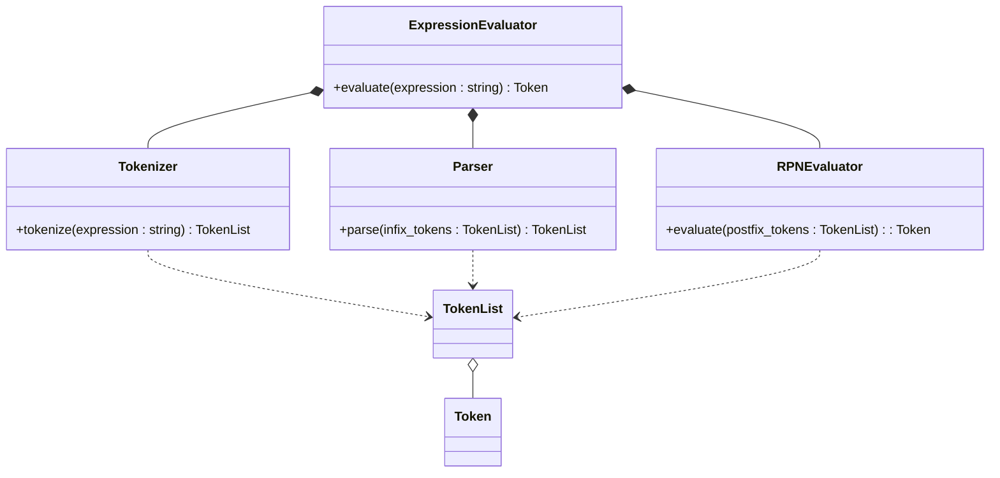
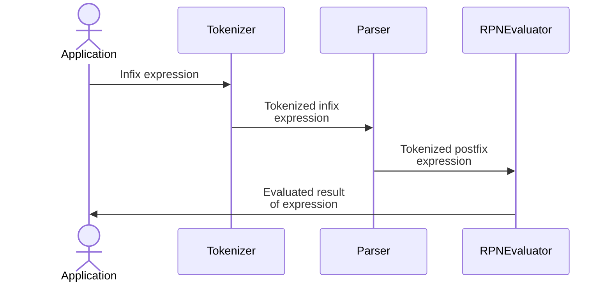
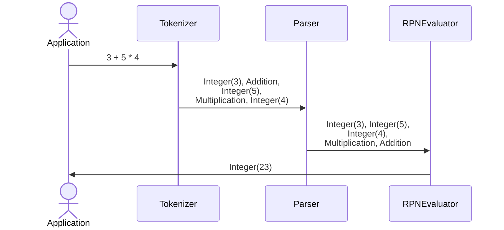

# exprevaluator

A Windows console application that ***evaluates mathematical expressions*** involving ***multiple operators*** and ***functions***. It supports operations on ***a variety of data types***, including Boolean, Integer, Real, and Variable.

## Features

-   Supports ***various operators***:

Type            |   Operators
:---------------|:----------------------------------------------------------------
**Unary**       |   Negation (`-x`), Not (`!x`), Factorial (`x!`)
**Arithmetic**  |   Addition (`+`), Subtraction (`-`), Multiplication (`*`), Division (`/`), Modulus (`%`), Power (`**`)
**Assignment**  |   Assignment (`=`)
**Logical**     |   And (`&&`), Nand (`!&&`), Or (`\|\|`), Nor (`!\|\|`)
**Relational**  |   Equality (`==`), Inequality (`!=`), Greater (`>`), GreaterEqual (`>=`), Less (`<`), LessEqual (`<=`)
**Bitwise**     |   Xor (`^`), Xnor (`!^`)

-   Includes ***built-in functions***:

Type            |   Functions
:---------------|:----------------------------------------------------------------
**One-Argument**|   `abs`, `arccos`, `arcsin`, `arctan`, `ceil`, `cos`, `exp`, `floor`, `lb`, `ln`, `log`, `sin`, `sqrt`, `tan`
**Two-Argument**|   `arctan2`, `max`, `min`, `pow`

-   Handles ***multiple data types***: Boolean, Integer, Real, and Variable.
-   Supports ***nested expressions*** and ***parentheses*** for complex calculations.
-   Simple, fast, and lightweight ***console-based*** interface.

## Shunting Yard Algorithm

The shunting yard algorithm is a method for parsing ***infix notation*** to ***postfix notation***, also known as ***reverse Polish notation*** (***RPN***):

-   A mathematical notation in which ***operators follow their operands***.
-   The notation does not need any ***parentheses*** for as long as each operator has a ***fixed number of operands***.
-   Algorithm: [Shunting Yard Algorithm](!docs/Parser.pdf)
-   Example:

Infix notation  |   Postfix Notation (Reverse Polish Notation)
:--------------:|:-----------------------------------------------------------:
3 + 4           |   3 4 +
3 x 6 + 4       |   3 6 x 4 +
(5 - 6) x 7     |   5 6 - 7 x
11 x 7 + 6 ÷ 3  |   11 7 x 6 3 ÷ +
5 ** 2 ** 3     |   5 2 3 ** **

## Boost.Multiprecision for Arbitrary Precision & Large Numbers

For ***high precision*** & ***handling large numbers*** beyond those of C++ standard built-in types like `std::int64_t` or `double`, the program utilizes ***Boost.Multiprecision*** library:

-   `boost::multiprecision::cpp_int`:
    -   An ***arbitrary-precision*** integer type, constrained only by ***available memory***.
    -   Comparison:

Type            |   Range
:--------------:|:-----------------------------------------------------------
`std::int64_t`  |   -9,223,372,036,854,775,808 to 9,223,372,036,854,775,807 (-263 to 263 - 1)
`cpp_int`       |   Effectively unlimited, constrained only by available memory

-   `boost::multiprecision::number<boost::multiprecision::cpp_dec_float<1000, int32_t, void>>`:
    -   ***High-precision*** floating-point arithmetic, providing up to ***1000 decimal places*** of precision.
    -   Comparison:

Type                    |   Maximum Precision   |   Range
:----------------------:|:---------------------:|:-------------------------------
`double`                |   15-17               |   ±1.8 × 10³⁰⁸
`cpp_dec_float<1000>`   |   1000                |   Effectively unlimited, constrained only by available memory

## Architecture

## Sequence Diagram

-   [Tokenizer](!docs/Tokenizer.pdf)
-   [Parser](!docs/Parser.pdf)
-   [RPNEvaluator](!docs/Evaluator.pdf)

## References

-   [Token](!docs/Token.md)
-   [Operand](!docs/Operand.md)
-   [Operator](!docs/Operator.md)
-   [Double Dispatch](!docs/Double%20Dispatch.md)